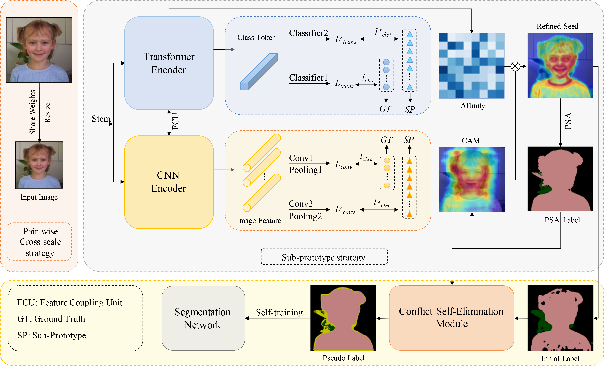

# PCSformer
Implementation of the paper: "PCSformer: Pair-wise Cross-wise Sub-prototypes Mining with CNN-Transformers for Weakly Supervised Semantic Segmentation"

<p align="left"></p>

## Abstract

## Prerequisite

#### 1. install dependencies 
Ubuntu 18.04, CUDA 11.4, Python 3.9.18 and the following python dependencies.

```pip install -r requirements.txt```

#### 2. Download dataset 
Download [the PASCAL VOC 2012 development kit](http://host.robots.ox.ac.uk/pascal/VOC/voc2012).

#### 3. Download pretrained weights and put under folder "weights"
Download [Conformer_small_patch16.pth](https://drive.google.com/file/d/1f8f_s3WKjXGMp5H0JcgEWmnoNEZu8BX1/view?usp=sharing).

Download [ilsvrc-cls_rna-a1_cls1000_ep-0001.params](https://drive.google.com/file/d/1Q4tuPLyudVQ8A11eSY63qPl74n7v8BPl/view?usp=sharing).

#### 4. Download saliency map
Download [saliency map](https://drive.google.com/file/d/1n7hVi8U2ylBMjz_bECsl_wSAmlRqnVr8/view?usp=share_link).

## Usage

#### 1. cd PC_1, Run the run_pc_voc.sh script for training PCSformer in the Pair-wise Cross scale (PC) strategy stage 

```bash run_pc_voc.sh```

#### 2. cd SP_2, Run the run_sp_voc.sh script for training PCSformer in the Sub-prototype (SP) strategy stage 

```bash run_sp_voc.sh```

#### 3. Train semantic segmentation network
To train DeepLab-v2, we refer to [deeplab-pytorch](https://github.com/kazuto1011/deeplab-pytorch).

## Testing

#### Download our trained weights
| Stage       | Backbone   | Google drive | mIoU (%) |
|--------------|------------|--------------|--------------|
| Initial seeds (after PC) | Conformer-S | [Weights](https://drive.google.com/file/d/1yTQApRtJS4xwfFKJBskKpnQ2HHUIR7_C/view?usp=sharing)  | 66.4 |
| Initial seeds (after SP) | Conformer-S | [Weights](https://drive.google.com/file/d/1cPcNtXbvgiSeKO3YYM-8Vp8SiyMVRS58/view?usp=drive_link)  | 68.2 |
| Final prediction (on VOC datasets) | ResNet101 | [Weights](https://drive.google.com/file/d/1UZsMlV-Sw2eUYf-uZDCEHqbpq7pnqyEK/view?usp=sharing)  | 72.8 |
| Final prediction (on COCO datasets) | ResNet101 | [Weights](https://drive.google.com/file/d/1tqEGDNulwA1DglK_PC3duZNv7YuPhP5d/view?usp=sharing)  | 41.9 |

## Acknowledgements
This code is borrowed from [TransCAM](https://github.com/liruiwen/TransCAM), [SC-CAM](https://github.com/Juliachang/SC-CAM), and [deeplab-pytorch](https://github.com/kazuto1011/deeplab-pytorch).
